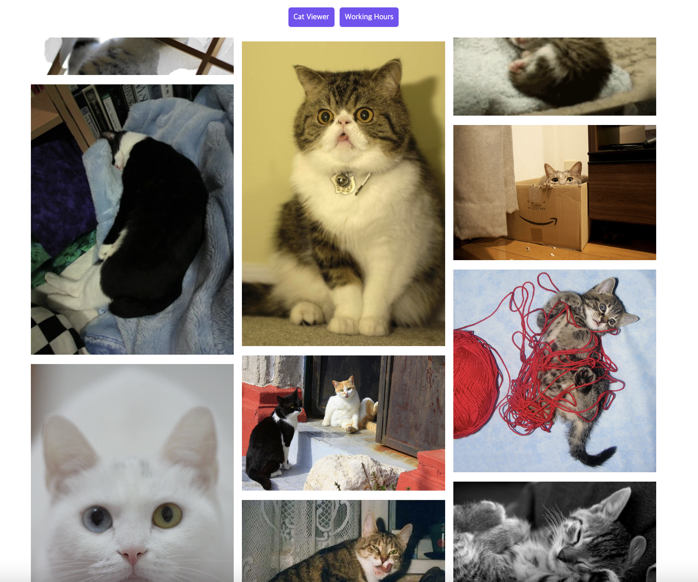
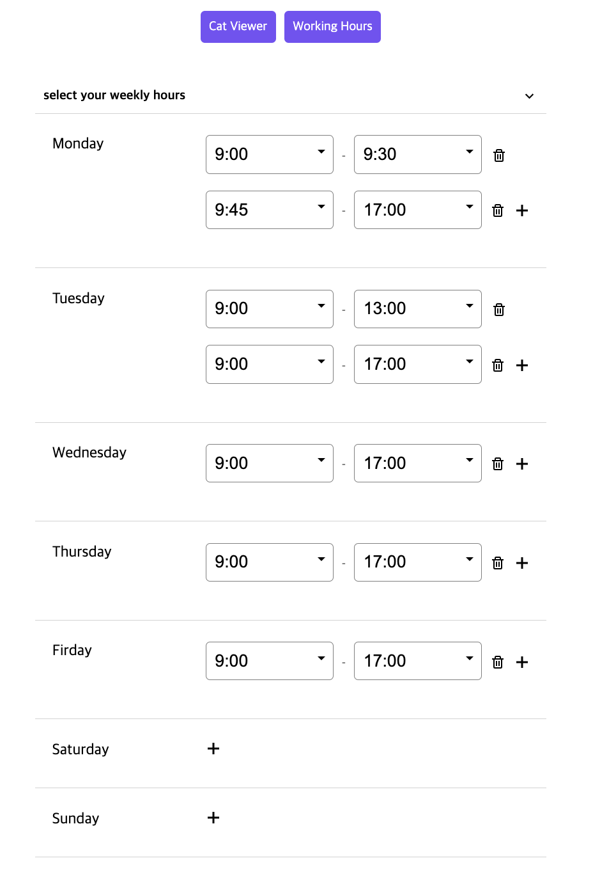

# 고양이 뷰어와 근무시간 폼

핀터레스트 형식의 랜덤 고양이 뷰어와 근무 시간을 지정할 수 있는 폼을 react로 구현했습니다.

</br>

## 실행 방법

```js
// http
git clone https://github.com/devCecy/cat-viewer-and-working-hour-form.git

// ssh
git clone git@github.com:devCecy/cat-viewer-and-working-hour-form.git

// 패키지를 다운로드 합니다.
npm i

// 프로젝트를 실행합니다.
npm run start
```

</br>

## 라이브러리

- typescript
- styled-components
- recoil -> redux
- axios / react-query
- react-icon
- react-masonry-css (masonry 형식)

</br>

## 고양이 뷰어 (/cat-viewer)

- 핀터레스트 형식으로 이미지가 보여집니다.
- 30개의 이미지가 무한스크롤로 로드됩니다.
- 이미지를 클릭하면 애니메이션과 함께 확대됩니다.
- 확대된 이미지를 클릭하면 이미지가 원래 사이즈로 돌아옵니다.
- 반응형을 제공합니다.



</br>

## 근무 시간 선택 폼 (/working-hour)

- 근무시간 섹션을 collapse 할 수 있습니다.
- 근무시간을 변경/업데이트 할 수있습니다.
- 근무시간 인풋을 추가하여 한 요일에 여러개의 근무시간을 지정할 수 있습니다.
- 근무시간 인풋을 삭제할 수 있습니다.
- 변경 중이던 근무시간을 취소하여 저장되어있는 시간을 다시 불러올 수 있습니다.
- 근무시간에 변경사항이 생기면 취소/업데이트 버튼이 생성됩니다.
- 근무 시작시간이 종료시간보다 크거나 같을 경우 error 문구가 뜨며, 업데이트 버튼은 비활성화 됩니다.
- 반응형을 제공합니다.



### 참고

- [TheCatAPI](https://developers.thecatapi.com/view-account/ylX4blBYT9FaoVd6OhvR?report=bOoHBz-8t)
- [getBoundingClientRect](https://developer.mozilla.org/ko/docs/Web/API/Element/getBoundingClientRect)
